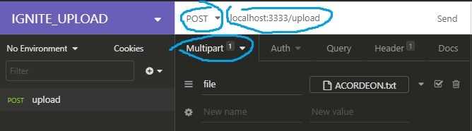

# Context
Example of file upload in nodejs using the [multer](https://www.npmjs.com/package/multer) middleware.

# Running
- Clone the repo
- run ```yarn``` in root directory to install dependencies
- run ```yarn dev``` to run the example
- Using any HTTP client (Insonmia, for example) do a post request
  
  